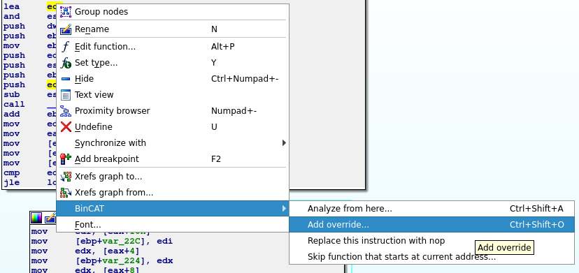
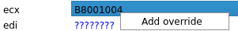
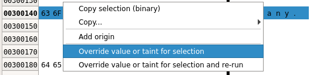
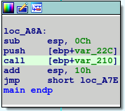
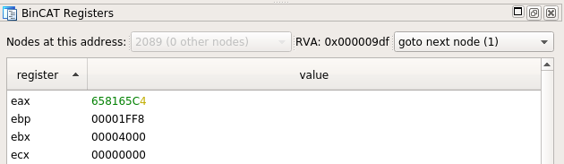
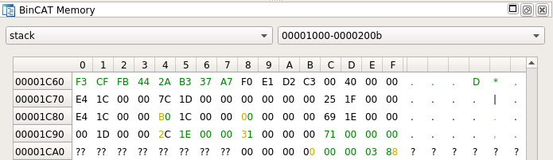
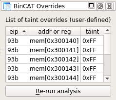
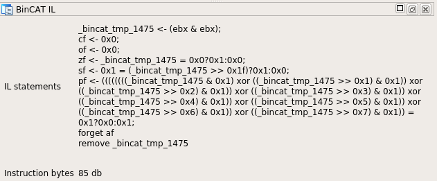
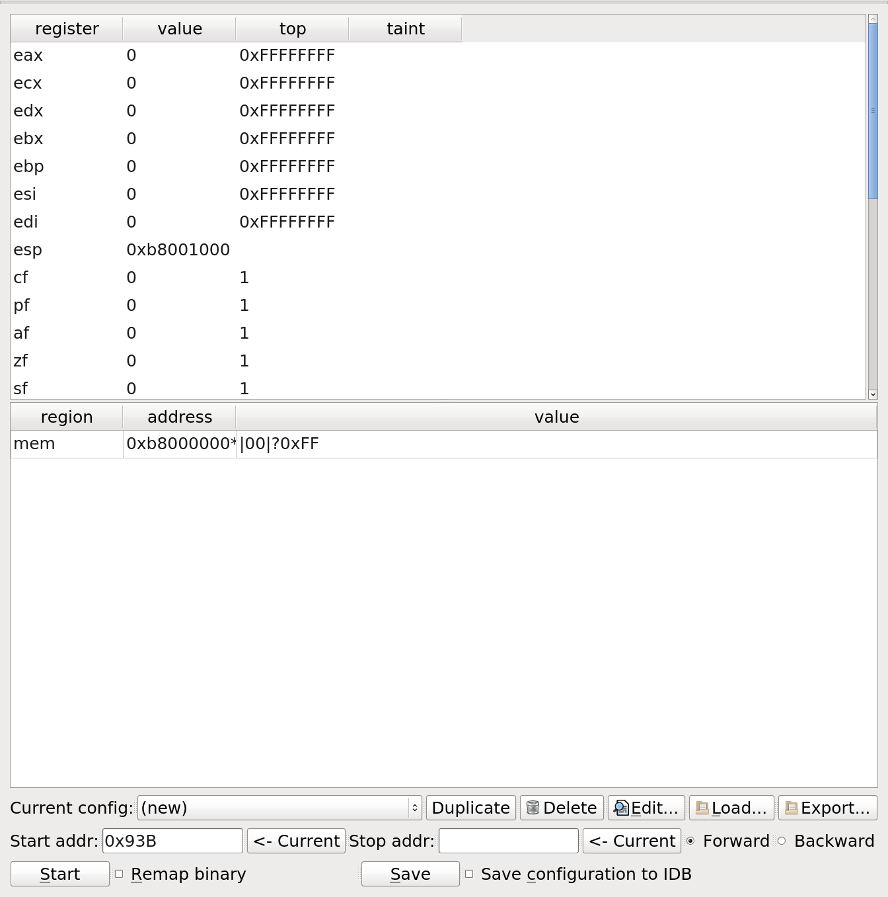

# BinCAT manual

## Table of contents
* [Installation](#installation)
* [Main commands and features](#main-commands-and-features)
* [IDA Views](#ida-views)
* [.ini file format](#ini-file-format)

## Installation
See [README](../README.md#installation).

## Main commands and features

### Launch the plugin
* Use the **Edit >> Plugins >> Bincat** menu, or the **Ctrl + Shift + b**
  shortcut

### Start an analysis
In the **IDA View-A** view, go to the instruction you want the analysis to
start from. Then, you should:
1. Use configuration pane to set the initial state and start address
2. Start the analysis from:
  * the "Start" button
  * the context menu (right click in **IDA View-A**), then select the
  **BinCAT >> Analyze from here** menu
  * the **Ctrl + Shift + a** shortcut

### Override taint or values
*Taint* or *Value* can be overridden for any register value or memory byte, at
any instruction of the program. Overrides will apply at the *next* instruction.

Overrides can be defined from the following views:
* from the **IDA View-A** view: right click on a register name or memory
  address, click the **BinCAT >> Add override...** contextual menu

* from the **IDA View-A** view: click on a register name or memory address,
  then use the **Ctrl + Shift + o** shortcut
* from the **BinCAT Registers** view which shows the registers: right click on
  a register, then choose the **Add override...** menu

* from the **BinCAT Memory** view which shows the contents of the memory: select
  a memory range, then right click, then choose the **Override value or taint for
  selection** menu

Overrides are made up of an optional value (ex. **|00|**, **0xF0**. Value will be left unchanged if not specified) and a mandatory taint mask (ex. **!0x0F**, **!|FF|**)

For register overrides, the following taint masks are also valid:
* **!TAINT_ALL** indicates that all register bytes are tainted
* **!TAINT_NONE** indicates that no register bytes are tainted

Defined taint overrides are then displayed in the **BinCAT Overrides** view.

## IDA Views

### IDA View-A view
On this view, the BinCAT plugin sets the background color for analyzed
instructions:
* Instructions that have been analyzed, but do not manipulate tainted data have
  a gray background
* Instructions that have been analyzed AND have at least one tainted operand
  have a non-gray background

For instructions that are not analyzed, the background color is not changed by
the BinCAT plugin.

### BinCAT Registers
This view displays taint, value and type for each register (general, flags,
segment registers), at a given point in the analysis.

The current RVA is displayed. The instruction that is present at this address
may have been analyzed several times, especially if it is part of a loop. In
that case, the analyzer will have created one "node" for each analysis. This
view allows choosing the node that is currently being viewed.

Additionally, at a given node, several paths may have been examined by the
analyzer, for instance separately considering the case where a malloc
allocation fails, and the case where it succeeds.

Register contents are represented:
* Values are represented as text, using both an hexadecimal and an ascii
  representation. The `?` value indicates that at least one bit of the
  represented byte or nibble is set to to abstract value **TOP**, meaning its
  value is unknown
* Taint is represented using colors, for each represented nibble or byte:
  * black means that none of its bits are tainted, with no taint uncertainty
  * green means that all of its bits are tainted, with no taint uncertainty
  * blue means that at least one of the bits is uncertainly tainted
  * yellow is used if there is no taint uncertainty, and some of the bits only
    are tainted
* Type is displayed as a tooltip, shown when the mouse hovers a register, if
  type data is available

### BinCAT Memory view

This view displays the memory contents. BinCAT's representation splits memory
into 2 regions: mem and heap, which can be chosen using a drop-down
menu on this view. Then, a second drop-down menu allow selecting the displayed
address range.

Memory contents are displayed as a grid, using the same conventions are for the **BinCAT Registers** view described above, regarding value, taint and type.

### BinCAT Overrides

This view lists all user-defined taint overrides, rendered as a grid. Overrides
can be directly modified by editing grid cells. To remove an override, right
click on the override that is to be removed, then choose the **Remove** menu.

This view also lists the instructions that are replaced with NOPs by BinCAT. To
replace an instruction with a NOP, right click this instruction in **IDA
View-A**, then select **BinCAT >> Replace this instruction with nop**

This view also lists functions that are skipped by BinCAT. To skip a function,
right click at its address in **IDA View-A**, select **BinCAT >> Skip function
that starts at current address...**, then input the number of arguments that
this function takes, as well as its return value, as requested by the dialog
box.

This view also features a **Re-run analysis** button, which allows conveniently
re-run the analysis, with updated overrides.

### BinCAT IL

This view displays the list of BinCAT intermediate language instruction that
represents the currently selected instruction, as well as the associated
instruction bytes. 

BinCAT only outputs intermediate language debugging data if loglevel > 2 in the
analysis parameters. This data is useful for BinCAT developers and debuggers.

### BinCAT Configuration pane

This pane is the starting point for BinCAT analysis. It contains:
* the initial state for registers
* the initial state for memory
* the entrypoint ("Start addr") for analysis
* the cut-off points for analysis ("Stop addr")
* the various configurations stored in the IDB, along with loading and export capabilities

### IDA Output Window

This view displays log messages that stem from the BinCAT plugin, or the BinCAT
analyzer.

It also features a python shell, which can be used to debug the BinCAT plugin:
a global variable (`bc_state`) allows accessing its internal objects.

## .ini file format

See the [dedicated page](ini_format.md).
