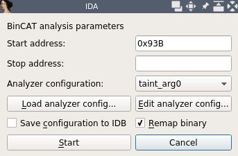
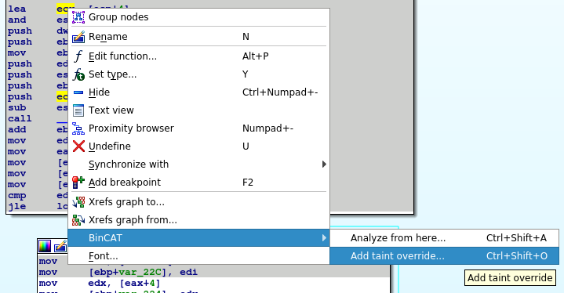
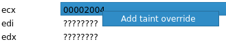
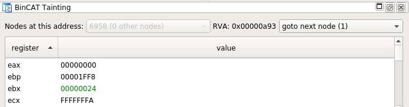
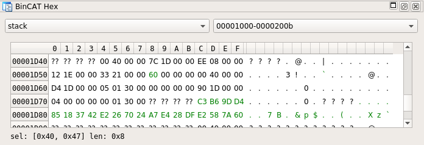
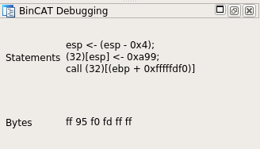
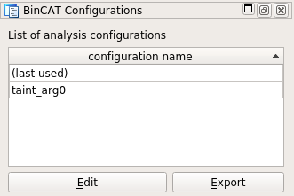

# Discovering the BinCAT IDA plugin

## Pre-requisites
1. BinCAT has to be installed first (see [README](README.md))
2. Download the [**get_key**](../../../raw/master/doc/get_key/get_key)
   executable from this repository

## BinCAT plugin Overview

### Main commands and features

#### Launch the plugin
* Use the **Edit >> Plugins >> Bincat** menu, or the **Ctrl + Shift + b**
  shortcut

#### Start an analysis
In the **IDA View-A** view, go to the instruction you want the analysis to
start from. Then, you can either:
* Use the **Edit >> BinCAT >> Analyze from here** menu
* Use the context menu (right click in **IDA View-A**), then select the
  **BinCAT >> Analyze from here** menu
* Use the **Ctrl + Shift + a** shortcut



* Click **Start** to run the analysis with a new configuration (automatically
  generated)

#### Override taint
*Taint* can be overridden for any register value or memory byte, at any
instruction of the program. Overrides will apply at the *next* instruction.

*Taint* overrides can be defined from the following views:
* from the **IDA View-A** view: right click on a register name or memory
  address, then use the **Edit >> BinCAT >> Add taint override...** menu, or
  the contextual menu (right click)



* from the **IDA View-A** view: click on a register name or memory address,
  then use the **Ctrl + Shift + o** shortcut
* from the **BinCAT Tainting** view which shows the registers: right click on
  a register, then choose the **Add taint override** menu



* from the **BinCAT Hex** view which shows the contents of the memory: select
  a memory range, then right click, then choose the **Override taint for
  selection** menu, and input a mask that must be applied to each selected byte


The following values can be used for register overrides:
* **TAINT_ALL** indicates that all register bytes are tainted
* **TAINT_NONE** indicates that no register bytes are tainted
* a binary or hexadecimal taint mask, such as **0x0F** or **0b00001111**, which
  will taint the least significant nibble, and untaint the others

For values stored in memory, binary or hexadecimal taint masks are supported.

Defined taint overrides are then displayed in the **BinCAT Overrides** view.


### IDA Views

#### IDA View-A view
On this view, the BinCAT plugin sets the background color for analyzed
instructions:
* Instructions that have been analyzed AND have at least one tainted operand
  have a green background
* Instructions that have been analyzed, but do not manipulate tainted data have
  a gray background


#### BinCAT Tainting
This view displays taint and value for each register (general, flags, segment
registers), at a given point in the analysis.

The current RVA is displayed. The instruction that is present at this address
may have been analyzed several times, especially if it is part of a loop. In
that case, the analyzer will have created one "node" for each analysis. This
view allows choosing the node that is currently being viewed.

Register contents are represented:
* Values are represented as text, using both an hexadecimal and an ascii
  representation. The `?` value indicates that at least one bit of the
  represented byte or nibble is set to to abstract value **TOP**, meaning its
  value is unknown
* Taint is represented using colors, for each represented nibble or byte:
  * black means that none of its bits are tainted, with no taint uncertainty
  * green means that all of its bits are tainted, with no taint uncertainty
  * blue means that at least one of the bits is uncertainly tainted
  * yellow is used if there is no taint uncertainty, and some of the bits only
    are tainted
* Type is displayed as a tooltip, shown when the mouse hovers a register, if
  type data is available



#### BinCAT Hex view

This view displays the memory contents. BinCAT's representation splits memory
into 3 regions: heap, stack, and global, which can be chosen using a drop-down
menu on this view. Then, a second drop-down menu allow selecting the displayed
address range.

Memory contents are displayed as a grid, using the same conventions are for the **BinCAT Tainting** view described above, regarding value, taint and type.



#### BinCAT Overrides

This view lists all user-defined taint overrides, rendered as a grid. Overrides
can be directly modified by editing grid cells. To remove an override, right
click on the override that is to be removed, then choose the **Remove** menu.

This view also features a **Re-run analysis** button, which allows conveniently
re-run the analysis, with updated overrides.


#### BinCAT Debugging

This view displays the list of BinCAT intermediate language instruction that
represents the currently selected instruction, as well as the associated bytes. 

BinCAT only outputs intermediate language debugging data if loglevel > 2 in the
analysis parameters. This data is useful for BinCAT developers and debuggers.



#### BinCAT Configurations

This view displays the list of BinCAT analysis configurations that were saved by the user. Users may:
* Display or edit configurations: select a configuration, then click the
  **Edit** button
* Export configurations; select a configuration, then click the **Export** button
* Delete configurations: select a configuration, right click, then choose the
  **Remove** menu



#### Ida Output Window

This view displays log messages that stem from the BinCAT plugin, or the BinCAT
analyzer.

It also features a python shell, which can be used to debug the BinCAT plugin:
a global variable (`bc_state`) allows accessing its internal objects.

## Tutorial

This tutorial gradually demonstrates BinCAT features, by analyzing a provided
keygen-me-style program, which takes a few arguments as command-line
parameters, then generates a hash depending on these parameters, and compares
it to an expected *license* value.

This program expects a few arguments:
```
$ ./get_key 
Usage: ./get_key company department name licence
```

It returns an error message if an incorrect license key is entered:
```
$ ./get_key company department name wrong_serial
Licence=>[025E60CB08F00A1A23F236CC78FC819CE6590DD7]
Invalid serial wrong_serial
```

The program indicates if the correct license key is entered:
```
$ ./get_key company department name 025E60CB08F00A1A23F236CC78FC819CE6590DD7
Licence=>[025E60CB08F00A1A23F236CC78FC819CE6590DD7]
Thank you for registering !
```

### 1. Run an analysis and observe results

1. Load the BinCAT plugin by using the **Ctrl + Shift + b** shortcut
2. Open the [**get_key**](../../../raw/master/doc/get_key/get_key)
   executable in IDA
3. From the **IDA View-A** view, go to address `0x93B` using the **g**
   shortcut
4. Use the **Ctrl-Shift-A** shortcut to open the analysis start window
5. Ensure that the **Analyzer configuration** dropdown is set to **(new)**
6. Check the **Save configuration to IDB** option
7. Check the **Remap binary** option
8. Click the **Edit analyzer config** button
9. In the `[state]` section, remove any line starting with `stack`
10. Paste the following lines at the end of the `[state]` section. This defines
   a value for `argc`, creates 5 pointers to strings, and initializes 5
   null-terminated strings, and also initialized a stack to **TOP** (unknown
   value)
```
stack[0x1000*4099] = |00|?0xFF
stack[0x2004] = 5
stack[0x2008] = 0x200000
mem[0x200000] = 0x300100
mem[0x200004] = 0x300140
mem[0x200008] = 0x300180
mem[0x20000C] = 0x3001C0
mem[0x200010] = 0x300200
mem[0x300100] = |6c6f6c3300|
mem[0x300140] = |636f6d70616e7900|
mem[0x300180] = |64657000|
mem[0x3001C0] = |6c6f6c3100|
mem[0x300200] = |6c6f6c2100|
```
11. Click **Save**
12. Click **Start**
13. Choose a location where the remapped binary should be saved. This will only
   be requested the first time an analysis is run on this binary
14. Enter a name under which this configuration should be saved
15. Notice that after a few seconds, the analysis has finished running, and the
    background for some of the instructions in the **IDA View-A** view has
    become gray
16. Go to address `0x807` using the **g** shortcut. This instruction is
    located directly before a call to `_sprintf(buffer, "Company = %s\n");`.
    Observe the value of the `esp` register in the **BinCAT Tainting** view (it
    should be `0x1D50`). At this address, you can observe the contents of the
    `buffer` pointer (`char *`) where `sprintf` results will be output (the
    value should be `0x1DEC`)
17. Advance to the next instruction at address `0x80C`, and observe the
    value of the `buffer` that has been formatted by `sprintf` at address
    `0x1DEC`
18. Hover your mouse over addresses `0x1D50`, `0x1D54`, `0x1D58` in the stack,
    and observe the inferred types for the call to `sprintf`
19. Go to address `0xA93`, which contains a call to a location that is stored
    on the stack. Notice that IDA cannot resolve the destination address. In
    the **BinCAT Tainting** view, use the *goto next node (1)* drop down menu
    to jump to the destination


### 2. Use taint override
This tutorial shows how to taint a register, and observe taint propagation.

1. Go back to address `0x93B`
2. Override the value of every byte at addresses `0x300140`-`0x300147` which
   contains the null-terminated `company` string (see section [Override
   taint](#override-taint)), and set it to `0xFF`
3. Advance to the next instruction at address `0x93F`, and observe that this
   memory range is indeed tainted: both the ascii and hexadecimal
   representations of this string are displayed as green text
4. In the **IDA View-A** view, notice that some instructions are displayed
   against a green background, since they manipulate tainted data
5. Go to address `0x9E6` (`push eax`). Observe that `eax` is partially tainted
6. Advance to the next instruction at address `0x9E7`. Notice that `eax` has
   been pushed to the stack, where its taint and value have been copied

### 3. Observe inputs handling

1. Use the tainting feature to show that the result of the CRC computation on
   the `department` argument does not influence the computed license key

