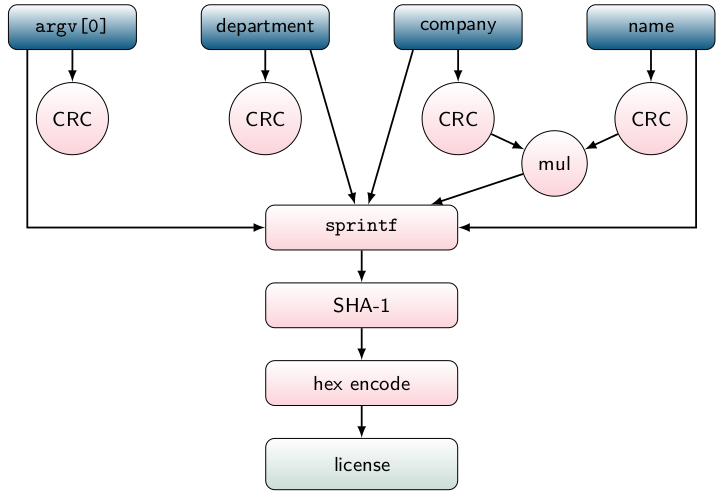

# BinCAT Tutorial

This tutorial gradually demonstrates BinCAT features, by analyzing a provided
keygen-me-style program, which takes a few arguments as command-line
parameters, then generates a hash depending on these parameters, and compares
it to an expected *license* value.

This program expects a few arguments:
```
$ ./get_key 
Usage: ./get_key company department name licence
```

It returns an error message if an incorrect license key is entered:
```
$ ./get_key company department name wrong_serial
Licence=>[025E60CB08F00A1A23F236CC78FC819CE6590DD7]
Invalid serial wrong_serial
```

The program indicates if the correct license key is entered:
```
$ ./get_key company department name 025E60CB08F00A1A23F236CC78FC819CE6590DD7
Licence=>[025E60CB08F00A1A23F236CC78FC819CE6590DD7]
Thank you for registering !
```



## Pre-requisites
1. BinCAT has to be installed first (see [README](../README.md#installation))
2. Download the [**get_key**](../../../raw/master/doc/get_key/get_key)
   executable from this repository

### 1. Run an analysis and observe results

1. Load the BinCAT plugin by using the **Ctrl + Shift + b** shortcut
2. Open the [**get_key**](../../../raw/master/doc/get_key/get_key)
   executable in IDA
3. From the **IDA View-A** view, go to address `0x93B` using the **g**
   shortcut
4. Use the **Ctrl-Shift-A** shortcut to open the analysis start window (see
   section [Start an analysis](manual.md#start-an-analysis) of the manual)
5. Ensure that the **Analyzer configuration** dropdown is set to **(new)**
6. Check the **Save configuration to IDB** option
7. Check the **Remap binary** option
8. Click the **Edit analyzer config** button
9. Paste the following lines at the end of the `[state]` section, **overwriting
   the existing stack initialization** (`stack[0x1000*8192]...`). This defines
   a value for `argc`, creates 5 pointers to strings, and initializes 5
   null-terminated strings, and also initialized a stack to **TOP** (unknown
   value)
```
stack[0x1000*4099] = |00|?0xFF
stack[0x2004] = 5
stack[0x2008] = 0x200000
mem[0x200000] = 0x300100
mem[0x200004] = 0x300140
mem[0x200008] = 0x300180
mem[0x20000C] = 0x3001C0
mem[0x200010] = 0x300200
mem[0x300100] = |6c6f6c3300|
mem[0x300140] = |636f6d70616e7900|
mem[0x300180] = |64657000|
mem[0x3001C0] = |6c6f6c3100|
mem[0x300200] = |6c6f6c2100|
```
10. Click **Save**
11. Click **Start**
12. Choose a location where the remapped binary should be saved. This will only
   be requested the first time an analysis is run on this binary
13. Enter a name under which this configuration should be saved
14. Notice that after a few seconds, the analysis has finished running, and the
    background for some of the instructions in the **IDA View-A** view has
    become gray
15. Go to address `0x807` using the **g** shortcut. This instruction is
    located directly before a call to `_sprintf(buffer, "Company = %s\n");`.
    Observe the value of the `esp` register in the **BinCAT Tainting** view (it
    should be `0x1D50`). At this address, you can observe the contents of the
    `buffer` pointer (`char *`) where `sprintf` results will be output (the
    value should be `0x1DEC`)
16. Advance to the next instruction at address `0x80C`, and observe the
    value of the `buffer` that has been formatted by `sprintf` at address
    `0x1DEC`
17. Hover your mouse over addresses `0x1D50`, `0x1D54`, `0x1D58` in the stack,
    and observe the inferred types for the call to `sprintf`
18. Go to address `0xA93`, which contains a call to a location that is stored
    on the stack. Notice that IDA cannot resolve the destination address. In
    the **BinCAT Tainting** view, use the *goto next node (1)* drop down menu
    to jump to the destination

### 2. Use taint override
This tutorial shows how to taint a register, and observe taint propagation.

1. Go back to address `0x93B`
2. Override the value of every byte at addresses `0x300140`-`0x300147` which
   contains the null-terminated `company` string (see section 
   [Override taint](manual.md#override-taint) of the manual), and set it to `0xFF`
3. Advance to the next instruction at address `0x93F`, and observe that this
   memory range is indeed tainted: both the ascii and hexadecimal
   representations of this string are displayed as green text
4. In the **IDA View-A** view, notice that some instructions are displayed
   against a green background, since they manipulate tainted data
5. Go to address `0x9E6` (`push eax`). Observe that `eax` is partially tainted
6. Advance to the next instruction at address `0x9E7`. Notice that `eax` has
   been pushed to the stack, where its taint and value have been copied

### 3. Observe inputs handling

1. Use the tainting feature to show that the result of the CRC computation on
   the `department` argument does not influence the computed license key

